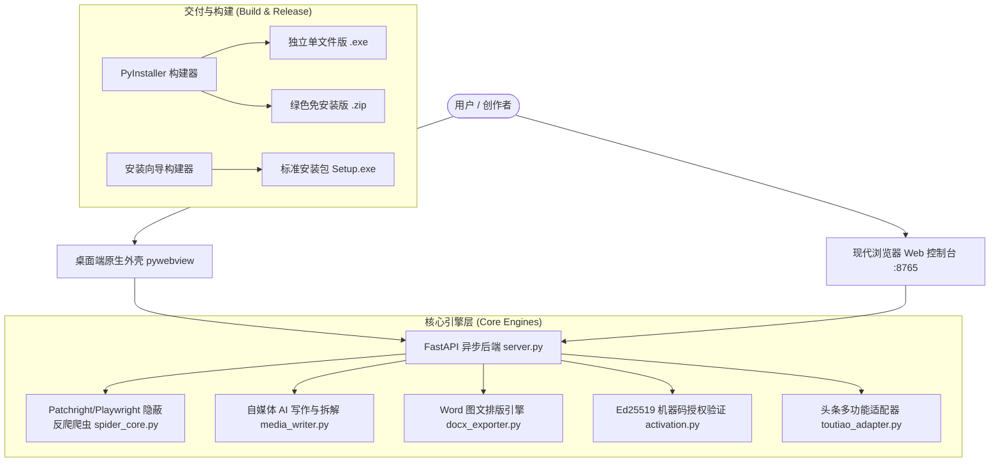

# XCbot · 今日头条采集与自媒体AI创作工作台 - 开发者与二次开发全景指南

> 本指南专为需要对本项目进行**源码备份、功能扩展、私有化部署、跨平台移植或二次商业化开发**的开发者编写。

---

## 📑 目录

1. [项目架构全景](#1-项目架构全景)
2. [技术栈清单](#2-技术栈清单)
3. [核心目录与源码模块结构](#3-核心目录与源码模块结构)
4. [本地开发与调试指南](#4-本地开发与调试指南)
5. [核心业务流与扩展实战](#5-核心业务流与扩展实战)
   - [5.1 扩展新平台采集器 (微信公众号 / 百家号 / 小红书)](#51-扩展新平台采集器)
   - [5.2 扩展 AI 创作模板与多模型接入](#52-扩展-ai-创作模板与多模型接入)
   - [5.3 前端 UI 主题与交互二次定制](#53-前端-ui-主题与交互二次定制)
   - [5.4 商业授权体系机制与私有化模式](#54-商业授权体系机制与私有化模式)
6. [一键打包与发布体系](#6-一键打包与发布体系)
7. [常见问题与调试技巧](#7-常见问题与调试技巧)

---

## 1. 项目架构全景

本项目采用**前后端分离 + 现代化本地混合桌面架构 (Local Hybrid Desktop Architecture)**：



---

## 2. 技术栈清单

| 分层 | 技术选型 | 说明 |
| :--- | :--- | :--- |
| **API 服务端** | FastAPI + Uvicorn + Pydantic | 高性能异步 Web 框架，自动生成 Swagger `/docs` 文档 |
| **反爬虫内核** | Patchright / Playwright + BeautifulSoup4 | 基于底层 Chromium CDP 抹除特征，绕过今日头条反爬检测 |
| **AI 创作模块** | 原生异步 HTTPX (OpenAI API 标准) | 兼容 DeepSeek、阶跃星辰、通义千问、SiliconFlow、OpenAI 等 |
| **文档生成** | python-docx + OpenPyXL | 标准 Word 图文优雅排版、Excel 多维互动数据统计表 |
| **桌面客户端** | PyWebView + WebView2 (Edge 内核) | 原生 Windows 窗口，极小内存占用，支持脱离浏览器独立运行 |
| **授权与安全** | Cryptography (Ed25519) + WMIC 底层硬件指纹 | 非对称椭圆曲线数字签名，硬件绑机，单调时钟防篡改水印 |
| **前端界面** | Vanilla ES6+ HTML5 + Glassmorphic CSS3 | 零 NPM 编译依赖，纯原生轻量化毛玻璃科技风，支持 SSE 进度流 |

---

## 3. 核心目录与源码模块结构

```text
今日头条采集与自媒体AI创作工作台/
├── activation.py               # 客户端非对称验签模块 (公钥验证/硬件机器码)
├── server.py                   # FastAPI 服务端入口 (所有 REST API + SSE 进度流)
├── scraper.py                  # 今日头条爬虫统一高级封装 (进度汇报与回调)
├── spider_core.py              # 爬虫底层实现 (Patchright 无头浏览器驱动、页面滚动、DOM提取)
├── task_manager.py             # 异步任务调度器 (支持取消、多任务隔离、状态广播)
├── desktop_app.py              # 桌面 GUI 客户端外壳 (PyWebView 窗口加载)
├── run.py                      # 独立命令行 (CLI) 爬虫入口
├── run_app.bat                 # 本地快速双击启动脚本 (启动服务端并拉起浏览器)
├── dev_setup.bat               # 开发者环境一键初始化脚本 (自动装依赖与浏览器内核)
├── requirements.txt            # 完整 Python 依赖清单
├── .gitignore                  # Git 忽略规则文件 (排除打包文件、缓存与密钥记录)
│
├── modules/                    # 🧩 业务核心扩展模块目录
│   ├── docx_exporter.py        # Word (.docx) 导出引擎 (含标题、元数据、正文与配图)
│   ├── media_writer.py         # 自媒体 AI 写作、仿写、爆款改写与大模型交互引擎
│   ├── security_guard.py       # 硬件底层特征熔炼 (CPU/主板/BIOS/UUID) 与防时间回拨
│   ├── toutiao_adapter.py      # 今日头条热搜 Top 50 榜单、关键词搜索与单篇直取
│   └── viral_analyzer.py       # 爆款文章综合评分、黄金开头提取与情绪触发词分析
│
├── static/                     # 🎨 前端单页应用资源 (纯原生，免构建)
│   ├── index.html              # 主控制台 HTML 骨架
│   ├── app.js                  # 前端交互与 API 通信核心逻辑
│   ├── style.css               # 毛玻璃科技质感样式表
│   ├── app_icon.ico            # 桌面应用图标
│   └── app_icon.png            # Web Favicon
│
├── license_tool/               # 🔐 开发者专属发码器 (私钥保存在此，勿分发给客户)
│   ├── generate_license.py     # 离线发码核心脚本 (支持周卡/月卡/季卡/年卡/永久)
│   ├── license_private_key.pem # 开发者专属 Ed25519 签名私钥
│   ├── license_public_key.pem  # 对应的公开验签公钥
│   └── 双击签发激活码.bat      # 开发者一键发卡批处理交互工具
│
├── data/                       # 💾 运行期配置与数据目录
│   ├── ai_config.json.example  # AI 大模型配置模板
│   └── ai_config.json          # 本地实际生效的模型配置 (需填入 key)
│
├── build_installer.py          # PyInstaller 客户端打包构建脚本
├── build_setup_package.py      # 独立安装向导程序构建器 (Setup.exe)
└── installer_wizard.py         # 图形化安装向导源码
```

---

## 4. 本地开发与调试指南

### 4.1 环境准备
1. 确保安装了 **Python 3.9 ~ 3.12** (推荐 64 位)。
2. 双击运行根目录下的 `dev_setup.bat`，或在命令行中手动执行：
   ```bash
   # 安装依赖包
   pip install -r requirements.txt
   
   # 安装浏览器自动化内核
   python -m patchright install chromium
   python -m playwright install chromium
   ```

### 4.2 启动调试模式

#### 模式 A：启动 Web API 服务端 (推荐，便于修改前端与 API)
```bash
python server.py
```
- 服务将监听 `http://127.0.0.1:8765/`。
- 访问 `http://127.0.0.1:8765/docs` 查看交互式 Swagger API 文档。

#### 模式 B：启动桌面客户端原生窗口
```bash
python desktop_app.py
```

#### 模式 C：命令行 (CLI) 快速爬虫调试
```bash
# 抓取指定作者最新 3 篇文章，并下载高清配图
python run.py -u "https://www.toutiao.com/c/user/token/..." -m 3 -d
```

---

## 5. 核心业务流与扩展实战

### 5.1 扩展新平台采集器
如果您需要新增 **微信公众号、百家号、小红书** 等平台的采集能力：
1. 在 `modules/` 下新建适配器（例如 `wechat_adapter.py` 或 `xiaohongshu_adapter.py`）。
2. 在 `server.py` 中引入并挂载路由（如 `/api/crawl/wechat`）。
3. 在 `static/index.html` 的顶部 Tab 栏增加对应的导航入口，在 `static/app.js` 中增加对应请求处理函数。

### 5.2 扩展 AI 创作模板与多模型接入
AI 创作核心位于 `modules/media_writer.py`：
- **添加新写作模式**：在 `MediaAIClient.generate_article_stream` 中扩充 prompt 类型（如短视频口播文案、小红书种草文案、知乎高赞问答）。
- **多模型配置**：编辑 `data/ai_config.json`，配置相应的 `api_base`、`api_key` 和 `model_name`。

### 5.3 前端 UI 主题与交互二次定制
前端采用纯原生架构，修改即时生效（无需 `npm run build`）：
- **UI 布局与文字**：编辑 `static/index.html`。
- **色彩与毛玻璃风格**：编辑 `static/style.css` 顶部的 `:root` 变量（支持轻松调整主色调、圆角与背景透明度）。
- **业务逻辑与图表**：编辑 `static/app.js`。

### 5.4 商业授权体系机制与私有化模式
- **二次开发免激活调试**：
  设置系统环境变量 `TOUTIAO_DEV_MODE=1`，系统将自动识别为开发者模式并全功能解锁。
- **更换自己的专属商业发卡公私钥**：
  1. 在 `license_tool/` 下重新生成 Ed25519 密钥对。
  2. 将生成的公钥替换至 `activation.py` 的 `PUBLIC_KEY_PEM` 变量中。
  3. 以后即可使用自己的私钥签发激活码。
- **私有化完全去激活化**：
  若自用或提供给企业私有化部署，直接在 `activation.py` 的 `get_license_status()` 中默认返回 `is_vip: True` 即可。

---

## 6. 一键打包与发布体系

### 6.1 生成绿色免安装文件夹
```bash
python build_installer.py
```
构建成功后，将在 `dist/ToutiaoStudio/` 生成完整的免安装可执行程序目录，内嵌浏览器驱动。

### 6.2 生成一键安装向导 (Setup.exe)
```bash
python build_setup_package.py
```
将在 `release/` 目录下生成标准安装向导程序 `ToutiaoStudio_Setup_v2.5.0.exe`。

---

## 7. 常见问题与调试技巧

1. **首次抓取报浏览器内核缺失？**
   - 运行 `python -m patchright install chromium` 即可自动补全。
2. **AI 写作提示 API 连接超时？**
   - 检查 `data/ai_config.json` 中的 `api_base` 是否正确包含 `/v1`，以及 API Key 余额是否充足。
3. **生成的 Word 文档排版异常？**
   - Word 导出器在 `modules/docx_exporter.py`，支持调整段落行距、字体样式、标题颜色与配图缩放比例。

---
*XCbot Studio · 全自研高性能自媒体自动化方案*
