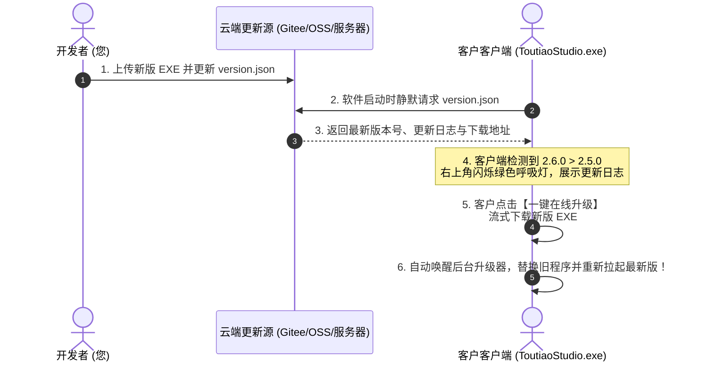

# XCbot · 客户端云端远程更新与公告推送配置教程

> 本系统已内置商业级**云端版本检测、紧急反爬公告广播推送、流式静默下载与 Windows 无缝热替换自重启升级**能力。
> 当您修复了 BUG 或开发了新功能时，只需在云端修改一个文件，即可**将更新与公告瞬间推送到所有用户的客户端**！

---

## 🌟 一、工作原理全景



---

## 🚀 二、零成本云端托管方案 (无需买服务器)

您不需要专门购买复杂的后端服务器，只需将一个轻量的 `version.json` 托管在任何公网可访问的地方：

### 🌟 方案 A：使用 GitHub + 内置 CDN 镜像加速 (最推荐！)
**无需担心国内访问慢！** 系统底层已内置 `jsDelivr` 与 `ghproxy` 国内极速 CDN 智能解析调度引擎，国内用户即使没有梯子/VPN 也能**秒级直连**！
1. 登录 [GitHub.com](https://github.com)，新建一个 **Public（公开）** 仓库，例如 `toutiao-updater`。
2. 将 `version.example.json` 复制并重命名为 `version.json`，提交上传至该仓库主分支（`main`）。
3. 复制原始 Raw 链接（例如 `https://raw.githubusercontent.com/您的用户名/toutiao-updater/main/version.json`）。
4. **客户端会自动将其智能转为国内免翻墙 CDN 节点**（如 `cdn.jsdelivr.net`），国内用户 100% 极速秒级拉取！

### 🌟 方案 B：使用 Gitee 码云 (国内全托管)
1. 注册/登录 [Gitee.com](https://gitee.com)。
2. 新建一个公开仓库，上传 `version.json`。
3. 点击进入 `version.json`，点击右侧的 **【原始数据】(Raw)** 按钮，复制直链。

### 🌟 方案 C：阿里云 OSS / 腾讯云 COS / 自建网站
1. 将 `version.json` 直接上传至对象存储或网站目录。
2. 复制公共读 URL 即可。

---

## 🛠️ 三、如何让客户端绑定您的云端更新源

您可以通过以下任意一种方式将客户端与您的云端地址绑定：

### 方式 1：源码内置 (最推荐，打包前修改一次即可)
打开 [`modules/remote_updater.py`](file:///c:/Users/lingx/Desktop/今日头条采集与自媒体AI创作工作台/modules/remote_updater.py)：
```python
DEFAULT_UPDATE_URLS = [
    "https://raw.githubusercontent.com/您的GitHub用户名/toutiao-updater/main/version.json"  # 替换为您的 GitHub 或 Gitee 地址
]
```
之后运行 `python build_installer.py` 打包，所有发给客户的 EXE 就会永远监听您的这个更新源！

### 方式 2：开发期临时指定 (环境变量)
在运行前设置系统环境变量：
```bash
set TOUTIAO_UPDATE_URL=https://your-domain.com/version.json
python desktop_app.py
```

---

## 👑 四、日常发版与推送流程 (只需 1 分钟)

当您后续写好了新功能（例如开发到了 `v2.6.0`），想推送给所有客户：

### 步骤 1：本地打包新版程序
```bash
python build_installer.py
```
生成新版可执行文件。

### 步骤 2：上传新版 EXE
将打包好的新版可执行文件（或压缩包）上传到您的网盘直链、OSS 或服务器，获取公开下载链接：
`https://your-domain.com/downloads/ToutiaoStudio_v2.6.0.exe`

### 步骤 3：修改云端 `version.json`
在 Gitee / OSS / 服务器上编辑您的 `version.json`：
```json
{
  "latest_version": "2.6.0",
  "release_date": "2026-09-01",
  "force_update": false,
  "title": "🎉 今日头条采集大师 v2.6.0 深度更新发布",
  "changelog": [
    "1. 🚀 升级反反爬内核，完美适配今日头条最新接口",
    "2. ✍️ 自媒体 AI 创作台新增知乎高赞/小红书爆款文风模式",
    "3. 📄 优化 Word (.docx) 图文导出排版",
    "4. ⚡ 修复离线机器码识别并提升启动性能"
  ],
  "download_url": "https://your-domain.com/downloads/ToutiaoStudio_v2.6.0.exe",
  "announcement": {
    "id": "ann_20260901",
    "title": "今日头条规则更新提醒",
    "content": "头条规则已于今日升级，请点击右上角更新至最新版！"
  }
}
```

### 步骤 4：推送瞬间生效！
- **所有客户在打开软件时**：
  1. 顶部会自动弹出蓝色的【📢 云端通知】横幅。
  2. 右上角版本徽章会亮起**绿色呼吸脉冲小红点**。
  3. 客户点击后弹出更新日志，点击**【一键在线升级】**即可全自动下载、替换旧程序并重启进入最新版！

---
*XCbot Studio · 商业化全功能交付体系*
